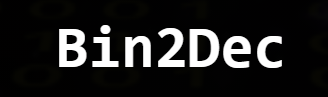
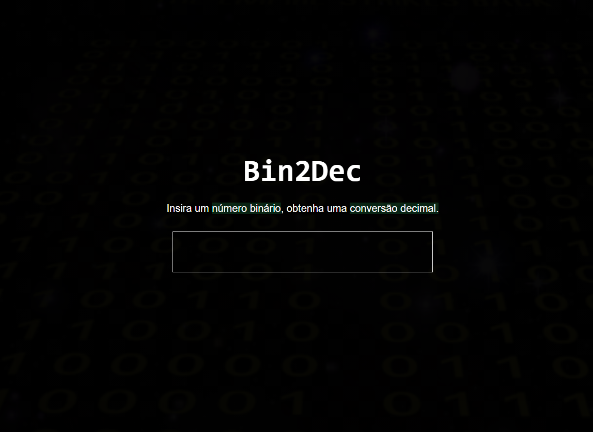

<p align="center">
  
</p>

<h1 align="center">
    
</h1>

<br>

## 🧪 Tecnologias

Esse projeto foi desenvolvido com as seguintes tecnologias:

- [React](https://reactjs.org)
- [TypeScript](https://www.javascript.com/)

## 🚀 Como executar

Clone o projeto e acesse a pasta do mesmo.

```bash
$ git clone https://github.com/leoander01/bin-2-dec.git
$ cd bin-2-dec
```
Para iniciá-lo, siga os passos abaixo:
```bash
# Instalar as dependências
$ yarn

# Iniciar o projeto
$ yarn start
```
O app estará disponível no seu browser pelo endereço http://localhost:3000.

## 💻 Projeto

VOcê pode acessar o projeto clicando aqui [Bin2Dec](https://bin-two-dec-leoander.netlify.app/).

O Bin2Dec foi desenvolvido como um projeto pessoal para ser adicionado ao meu portfólio.
